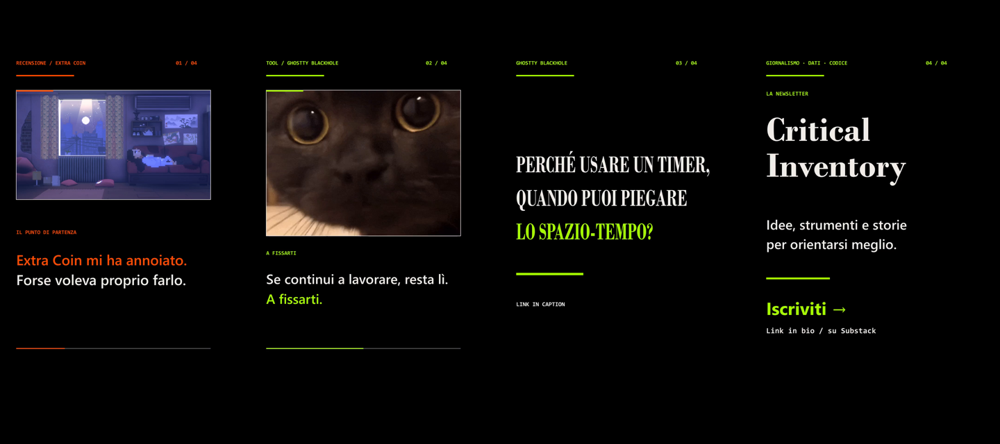

# Kdenlive da zero — la tua prima modifica al reel

Questa guida parte dal progetto già pronto. Non serve conoscere il montaggio,
scrivere codice o creare una timeline vuota. Alla fine avrai una frase
modificata, un'animazione più lenta e un nuovo MP4.

**Occorrente:** il repository completo e Kdenlive. Su questo PC la copia
26.08.0 è già nella `.cache` del template; su un altro PC segui prima il
[setup](README.md#setup-su-un-altro-pc). La cache non viene scaricata da GitHub.

La guida usa `v004` come esempio: sostituiscilo con il numero della tua base
(generata a partire da `v001` su un clone nuovo).

**Percorso consigliato:** apertura → orientamento → testo → animazione → export.
Puoi fare tutto sulla prima scena, lasciando le altre come riferimento.

I nomi dei comandi sono indicati anche in inglese quando utile: alcune
traduzioni dell'interfaccia possono differire. Le istruzioni seguono il manuale
26.08 e la struttura del nostro progetto. Il caricamento e il render sono stati
verificati automaticamente; l'interazione con mouse e tastiera resta da provare.

## 1. Apri la prova e crea la tua copia

1. In **Esplora file** raggiungi `templates → reel-v1`.
2. Fai doppio clic su **`APRI-PROVA.cmd`**. Si avvierà Kdenlive con la base
   dal numero più alto, per esempio `prova-v004.kdenlive`.
3. Se stai guardando il codice del `.cmd` in VS Code, sei nell'editor di testo:
   apri il file da Esplora file per eseguirlo.
4. Se Kdenlive è già aperto, puoi usare **File → Apri / Open** e scegliere
   `templates/reel-v1/edit/prova-v004.kdenlive`.
5. In Kdenlive scegli **File → Salva con nome / Save As**. Salva nella stessa
   cartella `edit`, chiamando la copia **`prova-v004-manuale.kdenlive`**.

Da questo momento lavora sulla copia: controlla il nome nella barra del titolo.
Per riprendere il lavoro domani, apri **la copia manuale** da File → Apri.
`APRI-PROVA.cmd` apre la base generata con il numero più alto. Per proseguire
un montaggio manuale riapri esplicitamente la sua copia salvata.

La cartella `edit/` e le copie manuali sono locali, escluse da Git: conservale
con i media in un backup o archivio Kdenlive. Un push non le trasferisce su GitHub.

Il file `.kdenlive` conserva il montaggio e i riferimenti ai materiali. Per
guardare o pubblicare il risultato serve anche l'esportazione `.mp4`.
Salvare ed esportare sono due operazioni diverse.
[Riferimento: avvio rapido](https://docs.kdenlive.org/en/getting_started/quickstart.html).

## 2. Riconosci le cinque zone dell'interfaccia

La disposizione può cambiare con il layout. Cerca i **nomi dei pannelli**:

| Pannello | A cosa serve | Nel nostro esercizio |
|---|---|---|
| **Contenitore del progetto / Project Bin** | Elenco di titoli, immagini e video disponibili | Qui trovi il titolo da riscrivere |
| **Monitor della clip / Clip Monitor** | Anteprima di una singola risorsa | Può mostrare il titolo isolato |
| **Monitor del progetto / Project Monitor** | Anteprima del montaggio completo | Qui controlli il reel con tutti i livelli |
| **Timeline** | Clip disposte nel tempo, su righe chiamate tracce | Qui selezioni il testo da animare |
| **Stack effetti/composizioni / Effect/Composition Stack** | Effetti dell'elemento selezionato | Qui trovi Transform e i keyframe |

Se manca un pannello, cercalo nel menu **Visualizza / View**. Il pannello
**Effetti / Effects** è il catalogo degli effetti disponibili; lo **stack**
mostra quelli già applicati. Per questa prova apri lo stack.
[Riferimento: pannelli degli effetti](https://docs.kdenlive.org/en/effects_and_filters.html#effect-composition-stack).

Premi **Play nel Monitor del progetto** per vedere il reel. La linea verticale
nella timeline è la **testina di riproduzione**: indica il momento che stai
guardando. Clicca sul righello dei tempi per spostarla. Con il monitor o la
timeline attivi, la **barra spaziatrice** avvia e ferma la riproduzione.
[Riferimento: riproduzione](https://docs.kdenlive.org/en/getting_started/quickstart.html#timeline).

## 3. Leggi la timeline della prova

Il video contiene quattro scene. I titoli stanno su tracce separate dalle
immagini: per questo puoi animare il testo senza spostare il footage.

| Secondi | Scena | Cosa riconosci |
|---|---|---|
| 0–5 | Narrazione | Mika sul divano, due righe di testo |
| 5–10 | Reaction | Demo del terminale, poi gatto; frase ferma |
| 10–15 | Title card | La battuta sullo spazio-tempo |
| 15–22 | Chiusura | Critical Inventory e invito a iscriversi |

*Questo è il risultato video, non una schermata dell'interfaccia di Kdenlive.*

Nella timeline trovi le tracce **Media**, **Cornici e metadata**, **Testo riga 1**,
**Testo riga 2**, **Testo riga 3 / descrizione** e **CTA**. Il nome di una traccia
indica il suo uso prevalente: per esempio la terza riga ospita anche la
descrizione della newsletter nel finale.

Per ingrandire i primi secondi usa il cursore di zoom della timeline.
Ingrandire la timeline cambia soltanto la vista, non la durata del video.

## 4. Primo esercizio: cambia una frase

**Obiettivo:** sostituire «Extra Coin mi ha annoiato.» con
«Extra Coin mi ha sorpreso.». È una frase di esercizio, non una nuova recensione.

1. Nel **Contenitore del progetto** cerca **`01-narrazione-riga-1`**.
   Se l'elenco è lungo, usa il suo campo di ricerca.
2. Fai doppio clic sul titolo. Si apre l'**editor dei titoli** in una finestra
   separata. In alternativa: clic destro sul titolo → **Modifica clip / Edit Clip**.
3. Entra nel testo facendo doppio clic sulle parole. Se vedi solo il riquadro
   dell'oggetto, devi ancora entrare nella modifica dei caratteri.
4. Quando compare il cursore dentro la frase, seleziona le parole e scrivi
   **`Extra Coin mi ha sorpreso.`**. `Ctrl+A` è comodo solo quando il cursore è
   già dentro quel testo.
5. Premi **Aggiorna titolo / Update Title** per applicare la modifica.
6. Nel **Monitor del progetto** vai circa al secondo 2: devi vedere la frase
   nuova sopra «Forse voleva proprio farlo.».
7. Salva il progetto con **Ctrl+S**.

Aggiornare un titolo modifica tutte le sue occorrenze nella timeline. Qui
ogni riga ha un titolo distinto. Per riscrivere la seconda riga apri
`01-narrazione-riga-2`.
[Riferimento: modificare un titolo](https://docs.kdenlive.org/en/titles_and_graphics/titles/titles.html#edit-a-title-clip).

### Font, dimensione, colore e posizione

Nell'editor dei titoli seleziona il testo e usa il pannello delle proprietà
per cambiare font, dimensione o colore. Verifica quali caratteri sono
selezionati prima di applicare la formattazione.
[Riferimento: proprietà del testo](https://docs.kdenlive.org/en/titles_and_graphics/titles/title_text.html).

Per mantenere l'aspetto della prova:

| Elemento | Impostazione di riferimento |
|---|---|
| Corpo narrativo | Segoe UI Semibold; 62 px nella prima scena |
| Titoli grandi | Bodoni MT Bold |
| Etichette piccole | Consolas Bold |
| Bianco osso | `#F2EFE9` |
| Verde | `#A6FF00` |
| Arancione | `#FF4D00` |

La prima scena usa l'arancione; le successive il verde. Se la frase nuova è
molto più lunga, prova prima ad accorciarla: gli a capo del prototipo sono
organizzati in titoli separati. Aggiungere una riga dentro il primo titolo può
sovrapporla alla seconda. Tieni il testo essenziale fra `x=70` e `x=910`.

Per spostare stabilmente il testo, seleziona il suo oggetto nell'editor dei
titoli e correggine la posizione. Se vuoi cambiare l'intera frase, aggiorna
entrambe le righe dello stesso spostamento.

## 5. Capisci un keyframe con il nostro esempio

Un **frame** è un fotogramma. Questa prova ne mostra **30 ogni secondo**.
Un **keyframe** registra il valore di una proprietà in un momento preciso:
fra due keyframe il programma calcola i valori intermedi.

La prima riga contiene già questa animazione:

| Fotogramma della clip | Tempo | Spostamento verticale di Transform | Opacità |
|---:|---|---:|---:|
| 0 | `00:00:00:00` | +24 px | 0% |
| 8 | `00:00:00:08` | 0 px | 100% |
| 149 | `00:00:04:29` | 0 px | 100% |

La frase parte invisibile e leggermente più in basso. In otto frame sale e
diventa visibile; poi resta ferma. Il terzo keyframe mantiene il risultato
fino alla fine della clip.

**`00:00:00:18` significa 18 fotogrammi, cioè 0,6 secondi.** L'ultimo gruppo
di cifre è un numero di frame, non di centesimi. Il frame dopo
`00:00:00:29` è `00:00:01:00`.

La posizione `Y=0` di Transform è lo spostamento del livello rispetto al suo
assetto iniziale: non significa che il testo vada in cima al video. La posizione
di base è già definita nell'editor dei titoli.

## 6. Secondo esercizio: rallenta l'entrata

**Obiettivo:** far arrivare la prima riga al frame **18**, invece che all'8,
mantenendo la scena lunga cinque secondi.

1. Chiudi l'editor dei titoli, se è aperto.
2. Nella **timeline**, fai un singolo clic sul clip
   **`01-narrazione-riga-1`**, fra 0 e 5 secondi sulla traccia del testo.
3. Apri lo **stack effetti** ed espandi **Transform / Trasforma**.
   L'effetto è già presente: non aggiungerne un secondo.
4. Nel piccolo righello dei keyframe seleziona il punto al frame **8**.
5. Sposta il cursore temporale al frame **18** e usa il comando
   **Sposta il keyframe selezionato al cursore / Move selected keyframe to cursor**.
   Passa il mouse sulle icone per leggerne il nome. Puoi usare il timecode del
   Monitor del progetto per raggiungere `00:00:00:18`: in questa prima scena
   tempo del progetto e tempo della clip coincidono.
6. Controlla che il punto di arrivo sia ora al frame 18, con **Y=0** e
   **opacità 100%**. Lascia il keyframe finale al frame 149.
7. Torna all'inizio e premi Play: la prima riga deve comparire più lentamente.

Questo metodo di spostamento è descritto nel
[manuale dei keyframe](https://docs.kdenlive.org/en/effects_and_filters.html#working-with-keyframes-in-the-effect-stack).

La seconda riga inizialmente parte al frame **2** e arriva al **10**.
Per rallentare entrambe conservando il piccolo ritardo, ripeti l'esercizio su
`01-narrazione-riga-2`, spostando il keyframe **10 → 20**. Conserva i punti
iniziali 0 e 2 e quello finale 149.

Non trascinare l'intero clip per ottenere questo risultato: cambieresti il
momento in cui appare la riga, non la velocità della sua entrata.

### Cambia quanto sale il testo

Sulla prima riga seleziona il keyframe iniziale e cambia **Y da 24 a 40**.
Lascia Y=0 all'arrivo e alla fine. Ora la frase percorre più spazio. Per
tornare al movimento originale rimetti 24.

Nel nostro titolo Transform lavora sul livello 1080×1920: lascia invariati
larghezza, altezza, scala e rotazione durante questo esercizio.
[Riferimento: Transform](https://docs.kdenlive.org/en/effects_and_filters/video_effects/transform_distort_perspective/transform.html).

### Distingui tre modifiche diverse

| Voglio… | Intervento nella prova |
|---|---|
| Riscrivere la frase | Editor del titolo |
| Farla entrare più lentamente | Spostare il keyframe di arrivo |
| Lasciarla leggibile più a lungo | Allungare il blocco di scena e riallineare gli altri elementi |

Il terzo intervento coinvolge più tracce. Per la prima prova mantieni la durata
attuale: allungare solo il titolo potrebbe lasciarlo sopra la scena successiva.

## 7. Trova e modifica la chiusura

Vai fra i secondi **15 e 22**. Nel Contenitore cerca questi nomi:

| Nome del titolo | Contenuto |
|---|---|
| `04-chiusura-brand-1` | Critical |
| `04-chiusura-brand-2` | Inventory |
| `04-chiusura-descrizione` | Etichetta newsletter e due righe descrittive |
| `04-chiusura-cta` | Iscriviti →, dettaglio del link e barra |

Apri il titolo come nell'esercizio 1 e seleziona soltanto il testo che vuoi
riscrivere. Descrizione e CTA contengono più oggetti nello stesso titolo.
La loro animazione Transform muove l'intero gruppo: nella CTA si muovono
insieme scritte e barra.

Questa chiusura è una versione editabile di prova. La locandina PNG del reel
Buco Nero originale rimane un'immagine unica, con le scritte già incorporate.

## 8. Salva e crea il tuo primo MP4

Prima premi **Ctrl+S**. Quindi apri **File → Genera / Render**, oppure
**Ctrl+Invio**.

Nella finestra di esportazione imposta:

| Voce | Valore per questa prova |
|---|---|
| Preset | MP4-H264/AAC |
| Intervallo | Progetto completo / Full Project |
| File di uscita | `templates/reel-v1/dist/prova-manuale-01.mp4` |
| Risoluzione | Mantieni quella del progetto: 1080×1920 |
| Audio | Disattivato per ottenere il master muto |

Se non vedi l'opzione audio, espandi **Altre opzioni / More Options**. Lascia
disattivati ridimensionamento e sovrimpressione del timecode. Premi
**Genera nel file / Render to File** e aspetta il completamento.
[Riferimento: esportazione](https://docs.kdenlive.org/en/exporting/render.html).

Apri l'MP4 in un lettore video e guarda tutti i 22 secondi. Controlla che la
frase nuova si legga, l'entrata sia più lenta e il gatto non sposti il testo.
Per una seconda esportazione usa `prova-manuale-02.mp4`.

Il profilo del progetto deve essere **Vertical HD 30 fps**, 1080×1920.
Puoi controllarlo nella finestra **Impostazioni del progetto / Project Settings**,
accessibile dal menu File nella documentazione 26.08. Non adattarlo alle
dimensioni orizzontali delle immagini: il reel resta verticale.
[Riferimento: impostazioni del progetto](https://docs.kdenlive.org/en/project_and_asset_management/project_settings.html).

## 9. Se qualcosa non torna

| Cosa vedi | Controllo da fare |
|---|---|
| Il `.cmd` si apre come testo | Avvialo da Esplora file; in VS Code stai leggendo il launcher |
| Hai riaperto la frase vecchia | Apri `prova-v004-manuale.kdenlive`; il launcher apre la base |
| Titolo invisibile al primo fotogramma | Nella nostra entrata l'opacità iniziale è 0%; guarda al secondo 1 |
| Vedi il testo senza immagini | Controlla di guardare il Monitor del progetto, non quello della clip |
| Lo stack non mostra Transform | Seleziona la riga nella timeline; il contenitore mostra la risorsa sorgente |
| Hai spostato il clip per errore | Ctrl+Z; poi seleziona il keyframe dentro lo stack |
| La frase esce dal margine | Accorcia il copy e controlla dimensione e posizione del titolo |
| Il testo deriva lentamente dopo l'entrata | Confronta i valori del keyframe di arrivo e di quello finale: nella prova devono coincidere |
| Mancano immagini o video | Verifica che `edit/` e `assets/` siano ancora nella cartella della prova; ricollega i file richiesti |
| Compare un font sostitutivo | Controlla la disponibilità di Bodoni MT, Segoe UI e Consolas sulla macchina |
| L'export contiene solo un pezzo | Seleziona Full Project invece della zona selezionata |

## 10. Completa il primo utilizzo

- [ ] La barra del titolo indica la copia `prova-v004-manuale.kdenlive`.
- [ ] La prima frase è cambiata.
- [ ] L'arrivo dell'animazione è al frame 18.
- [ ] Il progetto è salvato.
- [ ] Dopo chiusura e riapertura della copia, le modifiche sono ancora presenti.
- [ ] Hai esportato e guardato `prova-manuale-01.mp4`.

Il progetto manuale è il tuo lavoro nell'editor. Le sue modifiche non si
trasferiscono automaticamente in `project.json`: quando vorrai incorporarle
nel template generato dal codice, useremo la copia salvata come riferimento.
Per questa prima sessione non serve eseguire gli script Python.

[Torna al README della prova](README.md)
